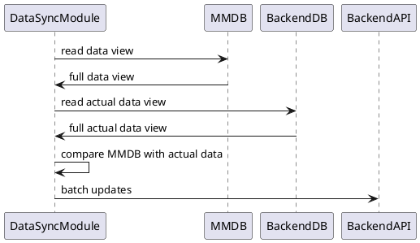

## Datasync Module

this module will update the backend database from an other source.
It will send the differences and update the actual data accordingly throught the backend API.

```plantuml
@startuml
DataSyncModule -> MMDB : read data view
MMDB -> DataSyncModule : full data view
DataSyncModule -> BackendDB : read actual data view
BackendDB -> DataSyncModule : full actual data view
DataSyncModule -> DataSyncModule : compare MMDB with actual data
DataSyncModule -> BackendAPI : batch updates
@enduml
```
